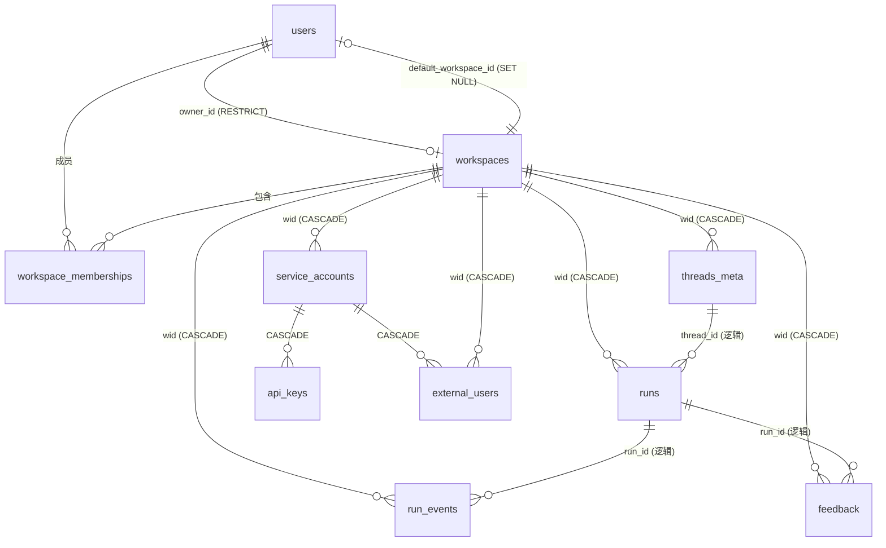

# 数据库设计 · 落地版（as-built）

> 写于 2026-06-27。**对照实现代码生成**，反映 Stage 0 PR1–PR8 合入后的真实 schema。
>
> 与 [workspace-schema-design.zh-CN.md](./workspace-schema-design.zh-CN.md) 的关系：那份是 **Stage 0 动手前的锁定版**（决策 + 不可逆点），本文是 **落地后的事实参考**。两者冲突时**以代码与本文为准**（锁定版里标 "待确认 / schema only" 的项，这里给出最终结果，例如 `run_events` 已确认为 DB 表并带 `workspace_id`）。
>
> **真源**：`backend/packages/harness/deerflow/persistence/`
> - 表定义：各子目录 `*/model.py`（如 `user/model.py`、`api_key/model.py`）+ `models/run_event.py`
> - 基类 / 引擎：`base.py` / `engine.py`
> - 迁移：`migrations/versions/0001..0003`

---

## 1. 持久化层总览

### 1.1 后端与建表

| 维度 | 说明 |
|---|---|
| 引擎 | 异步 SQLAlchemy（`create_async_engine`），见 `engine.py` |
| 后端三选一 | `memory`（不建引擎，仓储回退内存实现）/ `sqlite`（aiosqlite）/ `postgres`（asyncpg）。Stage 0 生产默认 **postgres** |
| 建表方式 | **dev**：启动时 `Base.metadata.create_all()` 自动建表（缺表即补，不改已存在的表）。**生产**：用 Alembic 迁移（`migrations/versions/`） |
| Postgres 自愈 | 目标库不存在时（报 `does not exist`），自动连到 `postgres` 维护库 `CREATE DATABASE` 后重建引擎重试（`_auto_create_postgres_db`） |
| SQLite 加固 | 每条连接启用 `PRAGMA journal_mode=WAL` + `synchronous=NORMAL` + `foreign_keys=ON` |
| JSON 序列化 | 自定义 `json.dumps(..., ensure_ascii=False)`，中文不转义 |
| 连接池 | postgres：`pool_size`（默认 5）+ `pool_pre_ping=True` |

> ⚠️ `create_all` 只**新建缺失的表**，**不会 ALTER 已存在的表**。给已有表加列/改约束必须走 Alembic 迁移；dev 下想偷懒可删库重建。

### 1.2 不归 ORM 管的表

LangGraph 的 **checkpointer**（`checkpoints*`）与 **store**（`store` / `store_migrations`）由 LangGraph 自己 `setup()` 建表，**不在** `Base.metadata` 里（见 `runtime/checkpointer/` 与 `runtime/store/`）。它们与本文的业务表**共用同一个 Postgres 库**，但生命周期、迁移各自独立。多租户隔离对这些表走"应用层强校验 + `UNIQUE(workspace_id, thread_id)` 兜底"（见 [ADR-001](./adr-001-data-isolation.zh-CN.md) / [spike-langgraph-postgres](./adr-spike-langgraph-postgres.zh-CN.md)）。

### 1.3 通用约定

- **主键 id**：业务实体用 `String(36)`（UUID v4 字符串），跨 SQLite/Postgres 可移植（Postgres 落 `CHAR(36)`，性能差异可忽略）。
- **时间**：一律 `DateTime(timezone=True)`，应用层写 `datetime.now(UTC)`；`updated_at` 在写入时自动更新。
- **枚举**：状态/角色用 `String(16)` + 应用层校验，**不用 DB enum**（Postgres enum 加值要 `ALTER TYPE`、不可删，扩展成本高）。
- **JSON 列**：用 SQLAlchemy 可移植 `JSON` 类型（Postgres 落 `json`），默认 `{}`。
- **partial unique / partial index**：同时声明 `sqlite_where` + `postgresql_where` 两套等价条件，双后端兼容。

---

## 2. 实体关系总览

**两条主线**：
1. **租户骨架**：`users` ↔ `workspaces`（多对多经 `workspace_memberships`）。workspace 是隔离粒度单位，每个用户注册自动建 1 人 workspace。
2. **业务数据**：`threads_meta` → `runs` → `run_events` / `feedback`，全部挂 `workspace_id`（行级隔离），workspace 删除时级联清空。
3. **Headless 接入**（Stage 0 末预建 schema）：`service_accounts` → `api_keys`（鉴权凭证）+ `external_users`（passthrough 终端身份）。

> `threads_meta.thread_id` / `runs.run_id` 与下游是**逻辑关联**（无 DB 外键，因 thread/run id 也被 LangGraph 表使用）；workspace 外键才是物理约束。

---

## 3. 表参考

> 列约定：所有 `created_at`/`updated_at` 为 `DateTime(tz)` NOT NULL，下表不再逐行重复说明。

### 3.1 `users` — 用户账户（本地密码 + OAuth）

| 列 | 类型 | 约束 | 说明 |
|---|---|---|---|
| `id` | String(36) | PK | UUID |
| `email` | String(320) | UNIQUE NOT NULL，索引 | 登录邮箱 |
| `password_hash` | String(128) | NULL | OAuth-only 用户为 NULL |
| `system_role` | String(16) | NOT NULL default `"user"` | 平台级角色 `admin`/`user`（与 workspace role 正交） |
| `oauth_provider` | String(32) | NULL | google/github… |
| `oauth_id` | String(128) | NULL | 提供商内用户 ID |
| `needs_setup` | Boolean | NOT NULL default `False` | 首次设置标记 |
| `token_version` | Integer | NOT NULL default `0` | 自增即吊销该用户所有旧 JWT |
| `default_workspace_id` | String(36) | NULL，FK `workspaces.id` **SET NULL** | 登录默认进入的 workspace；NULL 走 picker |
| `created_at` | DateTime(tz) | NOT NULL | |

**索引**：`idx_users_oauth_identity` UNIQUE `(oauth_provider, oauth_id)`，仅当两者均非 NULL（partial）。

### 3.2 `workspaces` — 工作空间（多租户隔离单位）

| 列 | 类型 | 约束 | 说明 |
|---|---|---|---|
| `id` | String(36) | PK | UUID |
| `name` | String(64) | NOT NULL | 显示名 |
| `slug` | String(32) | UNIQUE NOT NULL | URL 标识 `^[a-z0-9](-?[a-z0-9])*$`，3–32 字符 |
| `status` | String(16) | NOT NULL default `"active"` | `active`/`suspended`/`deleted` |
| `owner_id` | String(36) | NOT NULL，FK `users.id` **RESTRICT** | 冗余 owner；删 owner 被阻拦 |
| `created_at` / `updated_at` | DateTime(tz) | NOT NULL | |

> slug 黑名单（`admin`/`api`/`auth`/`_next`/… 见锁定版 §2.1）走应用层校验，不入 DB 约束。

### 3.3 `workspace_memberships` — 成员（RBAC）

| 列 | 类型 | 约束 | 说明 |
|---|---|---|---|
| `workspace_id` | String(36) | **复合 PK**，FK `workspaces.id` **CASCADE** | |
| `user_id` | String(36) | **复合 PK**，FK `users.id` **CASCADE** | |
| `role` | String(16) | NOT NULL | Stage 0 仅 `owner`；Stage 2 起 `admin`/`member` |
| `invited_by` | String(36) | NULL，FK `users.id` **SET NULL** | Stage 2 invitation 才写 |
| `joined_at` | DateTime(tz) | NOT NULL | |

**索引**：
- 复合 PK `(workspace_id, user_id)`
- `idx_workspace_memberships_user` `(user_id, workspace_id)` — 倒查"某 user 的所有 workspace"
- `idx_one_owner_per_workspace` UNIQUE `(workspace_id)` WHERE `role='owner'`（partial）— 每 workspace 恰好 1 owner

### 3.4 `threads_meta` — 会话元数据

| 列 | 类型 | 约束 | 说明 |
|---|---|---|---|
| `thread_id` | String(64) | PK | LangGraph thread_id |
| `assistant_id` | String(128) | NULL，索引 | 自定义 agent 名；NULL=默认 lead agent |
| `user_id` | String(64) | NULL，索引 | 所有者；NULL=历史无主 |
| `workspace_id` | String(36) | NOT NULL（0003 后），FK `workspaces.id` **CASCADE** | |
| `display_name` | String(256) | NULL | 自动标题或用户改名 |
| `status` | String(20) | NOT NULL default `"idle"` | `idle`/`busy` |
| `metadata_json` | JSON | NOT NULL default `{}` | |
| `created_at` / `updated_at` | DateTime(tz) | NOT NULL | |

**索引**：
- `idx_threads_meta_workspace_user_updated` `(workspace_id, user_id, updated_at)` — 前端 thread list 默认查询
- `idx_threads_meta_workspace_thread` UNIQUE `(workspace_id, thread_id)`（0003 加）— 防跨 workspace 复用同 thread_id

### 3.5 `runs` — 单次 agent 运行（含 token 指标）

| 列 | 类型 | 约束 | 说明 |
|---|---|---|---|
| `run_id` | String(64) | PK | |
| `thread_id` | String(64) | NOT NULL，索引 | 所属会话 |
| `assistant_id` | String(128) | NULL | |
| `user_id` | String(64) | NULL，索引 | |
| `workspace_id` | String(36) | NOT NULL（0003 后），FK `workspaces.id` **CASCADE** | |
| `status` | String(20) | NOT NULL default `"pending"` | `pending`/`running`/`success`/`error`/`timeout`/`interrupted` |
| `model_name` | String(128) | NULL | |
| `multitask_strategy` | String(20) | NOT NULL default `"reject"` | `reject`/`interrupt`/`rollback`/`enqueue` |
| `metadata_json` / `kwargs_json` | JSON | NOT NULL default `{}` | 运行级元数据 / 提交参数 |
| `error` | Text | NULL | 失败错误文本 |
| `message_count` | Integer | NOT NULL default `0` | |
| `first_human_message` / `last_ai_message` | Text | NULL | 文本预览 |
| `total_input_tokens` / `total_output_tokens` / `total_tokens` | Integer | NOT NULL default `0` | 累计 token |
| `llm_call_count` | Integer | NOT NULL default `0` | |
| `lead_agent_tokens` / `subagent_tokens` / `middleware_tokens` | Integer | NOT NULL default `0` | 分项 token（主 agent / 子 agent / 中间件） |
| `follow_up_to_run_id` | String(64) | NULL | 续接的上一次运行（重新生成/继续） |
| `created_at` / `updated_at` | DateTime(tz) | NOT NULL | |

**索引**：`ix_runs_thread_status` `(thread_id, status)`。

### 3.6 `run_events` — 运行事件流（回放 + 审计真源）

| 列 | 类型 | 约束 | 说明 |
|---|---|---|---|
| `id` | Integer | PK autoincrement | |
| `thread_id` | String(64) | NOT NULL | |
| `run_id` | String(64) | NOT NULL，索引 | |
| `user_id` | String(64) | NULL，索引 | |
| `workspace_id` | String(36) | NOT NULL（0003 后），FK `workspaces.id` **CASCADE** | |
| `event_type` | String(32) | NOT NULL | 子类型（`ai_message_chunk`/`tool_call`…） |
| `category` | String(16) | NOT NULL | `message`/`trace`/`lifecycle` |
| `content` | Text | NOT NULL default `""` | 事件文本 |
| `event_metadata` | JSON | NOT NULL default `{}` | |
| `seq` | Integer | NOT NULL | thread 内全局递增序号 |
| `created_at` | DateTime(tz) | NOT NULL | |

**索引**：
- `uq_events_thread_seq` UNIQUE `(thread_id, seq)`
- `ix_events_thread_cat_seq` `(thread_id, category, seq)`
- `ix_events_run` `(thread_id, run_id, seq)`

### 3.7 `feedback` — 运行反馈（赞/踩 + 评论）

| 列 | 类型 | 约束 | 说明 |
|---|---|---|---|
| `feedback_id` | String(64) | PK | |
| `run_id` | String(64) | NOT NULL，索引 | |
| `thread_id` | String(64) | NOT NULL，索引 | |
| `user_id` | String(64) | NULL，索引 | |
| `workspace_id` | String(36) | NOT NULL（0003 后），FK `workspaces.id` **CASCADE** | |
| `message_id` | String(64) | NULL | NULL=针对整次运行而非单条消息 |
| `rating` | Integer | NOT NULL | +1 赞 / -1 踩 |
| `comment` | Text | NULL | |
| `created_at` | DateTime(tz) | NOT NULL | |

**索引**：`uq_feedback_thread_run_user` UNIQUE `(thread_id, run_id, user_id)` — 一人对一次运行只一条反馈。

### 3.8 `service_accounts` — 服务账号（headless 非人身份）

| 列 | 类型 | 约束 | 说明 |
|---|---|---|---|
| `id` | String(36) | PK | |
| `workspace_id` | String(36) | NOT NULL，FK `workspaces.id` **CASCADE**，索引 | |
| `name` | String(64) | NOT NULL | |
| `role` | String(16) | NOT NULL default `"member"` | |
| `identity_mode` | String(16) | NOT NULL default `"collapsed"` | `collapsed`/`external_passthrough`/`both` |
| `status` | String(16) | NOT NULL default `"active"` | `active`/`suspended`/`deleted` |
| `created_by` | String(36) | NOT NULL，FK `users.id` **RESTRICT** | 创建者（owner/admin） |
| `created_at` / `updated_at` | DateTime(tz) | NOT NULL | |

**索引**：`idx_service_accounts_workspace` `(workspace_id, status)`。

### 3.9 `api_keys` — API Key（headless 凭证）

| 列 | 类型 | 约束 | 说明 |
|---|---|---|---|
| `id` | String(36) | PK | |
| `service_account_id` | String(36) | NOT NULL，FK `service_accounts.id` **CASCADE**，索引 | |
| `key_prefix` | String(16) | UNIQUE NOT NULL | 公开 prefix（`dfk_live_…`），可打日志 |
| `key_hash` | String(128) | NOT NULL | 完整 token 的 sha-256 hex |
| `name` | String(64) | NOT NULL | 标签（同 SA 内不强制唯一） |
| `scopes` | String(1024) | NOT NULL default `""` | 逗号分隔（`threads:read,threads:write`） |
| `rate_limit_rpm` | Integer | NULL | NULL=走 SA 默认 |
| `expires_at` / `last_used_at` / `revoked_at` | DateTime(tz) | NULL | `revoked_at` 非空=软删，不删行 |
| `created_at` | DateTime(tz) | NOT NULL | |

**索引**：
- `idx_api_keys_sa` `(service_account_id)`
- `idx_api_keys_active` `(key_prefix)` WHERE `revoked_at IS NULL`（partial）— 鉴权热路径只扫活跃 key

### 3.10 `external_users` — 终端用户身份（passthrough）

| 列 | 类型 | 约束 | 说明 |
|---|---|---|---|
| `id` | String(36) | PK | ghost user id |
| `workspace_id` | String(36) | NOT NULL，FK `workspaces.id` **CASCADE** | 冗余存，加速跨 SA 的 workspace 查询 |
| `service_account_id` | String(36) | NOT NULL，FK `service_accounts.id` **CASCADE** | |
| `external_id` | String(128) | NOT NULL | 调用方传入的 `X-External-User-Id`，原样存 |
| `display_name` | String(128) | NULL | 仅 admin UI 展示 |
| `metadata_json` | JSON | NOT NULL default `{}` | plan tier / region / tag |
| `created_at` | DateTime(tz) | NOT NULL | 首见时间 |
| `last_seen_at` | DateTime(tz) | NULL | |

**索引**：`uq_external_users_sa_external` UNIQUE `(service_account_id, external_id)` — 同一 SA 下 external_id 唯一（鉴权中间件按此 upsert）。

---

## 4. 外键与删除策略一览

| 子表 | 外键列 | 指向 | ON DELETE | 含义 |
|---|---|---|---|---|
| users | default_workspace_id | workspaces.id | **SET NULL** | 默认 workspace 没了就清空，用户仍在 |
| workspaces | owner_id | users.id | **RESTRICT** | 不能直接删 owner，需先转移 |
| workspace_memberships | workspace_id | workspaces.id | **CASCADE** | 删 workspace → 成员清空 |
| workspace_memberships | user_id | users.id | **CASCADE** | 删 user → 其成员关系清空 |
| workspace_memberships | invited_by | users.id | **SET NULL** | 删邀请人，保留成员关系 |
| threads_meta / runs / run_events / feedback | workspace_id | workspaces.id | **CASCADE** | 删 workspace → 业务数据全清 |
| service_accounts | workspace_id | workspaces.id | **CASCADE** | 删 workspace → SA 清空 |
| service_accounts | created_by | users.id | **RESTRICT** | 不能删 SA 创建者 |
| api_keys | service_account_id | service_accounts.id | **CASCADE** | 删 SA → key 清空 |
| external_users | workspace_id | workspaces.id | **CASCADE** | |
| external_users | service_account_id | service_accounts.id | **CASCADE** | |

**心智模型**：删 workspace = 整租户级联清空（业务数据 + SA + key + 外部身份）；user 作为他人的 owner/creator 受 RESTRICT 保护，不能"误删带塌一片"。

---

## 5. 迁移历史（Alembic）

> dev 用 `create_all` 直接建到最新；生产/已有库用迁移逐步推进。`migrations/versions/`：

| 版本 | 依赖 | 变更 | 要点 |
|---|---|---|---|
| **0001** `users_default_workspace` | — | `users` 加 `default_workspace_id`（nullable）+ FK→`workspaces.id` SET NULL | 无需回填（nullable） |
| **0002** `business_tables_workspace` | 0001 | `threads_meta`/`runs`/`feedback`/`run_events` 各加 `workspace_id`（**nullable**）+ FK CASCADE；`threads_meta` 加 `(workspace_id,user_id,updated_at)` 索引 | 先 nullable，留给 `scripts/backfill_workspace_id.py` 回填 |
| **0003** `business_tables_workspace_not_null` | 0002 | 4 张表 `workspace_id` 改 **NOT NULL**；`threads_meta` 加 `(workspace_id,thread_id)` UNIQUE | **升级前校验**：任一表仍有 `workspace_id IS NULL` 则拒绝升级，逼先跑回填脚本 |

**两段式上线**（0002→0003）是为了零停机：先加可空列 → 后台回填 → 校验通过再锁 NOT NULL，避免大表 ALTER 长锁与脏数据静默写入。

---

## 6. 与设计锁定版的差异 / 落地补充

| 项 | 锁定版 | 落地实际 |
|---|---|---|
| `run_events.workspace_id` | "待确认是否 DB 表" | **已确认**为 DB 表，比照 runs 加 `workspace_id` + CASCADE，并入 0002/0003 |
| `runs` token 指标列 | 未在 schema 文档列出 | 实际有完整一组：`total_*_tokens` / `llm_call_count` / `lead_agent_tokens` / `subagent_tokens` / `middleware_tokens` |
| `service_accounts.status` | `active/suspended/revoked` | 落地为 `active/suspended/deleted`（与 workspace 状态机一致） |
| `api_keys.scopes` 默认 | `''` | 一致（`String(1024)`，逗号分隔） |
| 索引名 | 设计期未定名 | 见各表"索引"小节（如 `ix_runs_thread_status`、`uq_events_thread_seq`） |

> 不可逆决策（id 类型 / 命名 / slug / 复合 PK / TokenPayload / FK 删除策略）均按锁定版 §5 执行，未变。

---

## 7. 配套阅读

- [workspace-schema-design.zh-CN.md](./workspace-schema-design.zh-CN.md) — Stage 0 schema 锁定版（决策依据 + 不可逆点 + JWT TokenPayload）
- [adr-001-data-isolation.zh-CN.md](./adr-001-data-isolation.zh-CN.md) — 行级 `workspace_id` + Postgres RLS + LangGraph 表两层模型
- [adr-004-tenant-rbac.zh-CN.md](./adr-004-tenant-rbac.zh-CN.md) — RBAC + JWT 设计
- [adr-spike-langgraph-postgres.zh-CN.md](./adr-spike-langgraph-postgres.zh-CN.md) — 为何 LangGraph 表不归 ORM 管
- [03-impl/STATUS.zh-CN.md](../03-impl/STATUS.zh-CN.md) + `03-impl/pr8-headless-api-schema.zh-CN.md` — PR 级实现进度
